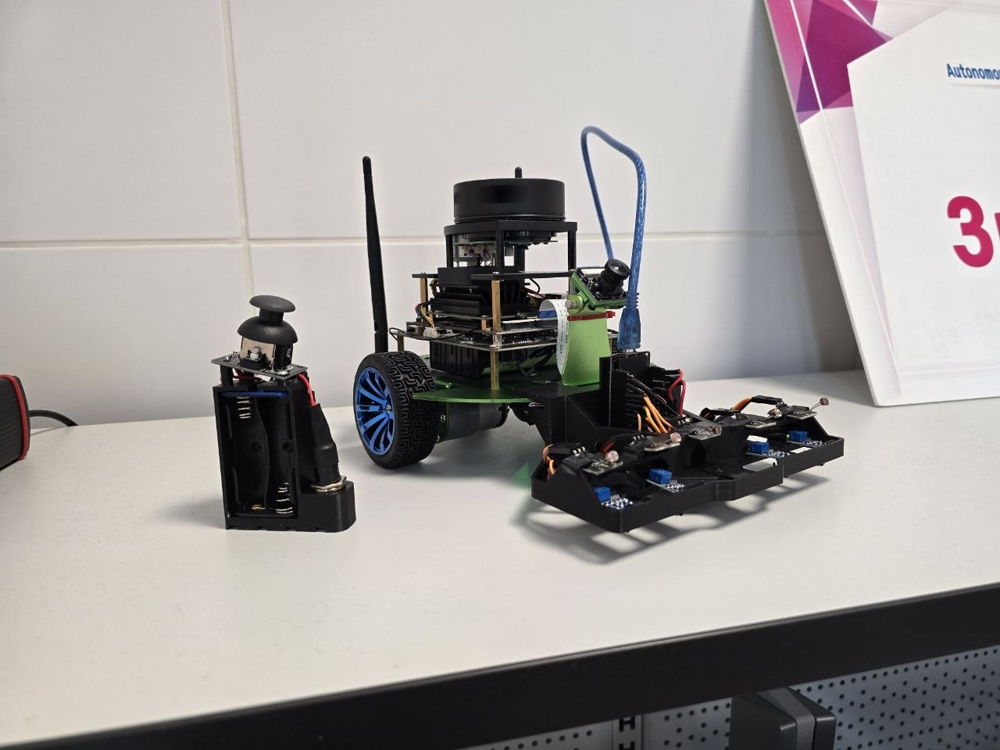
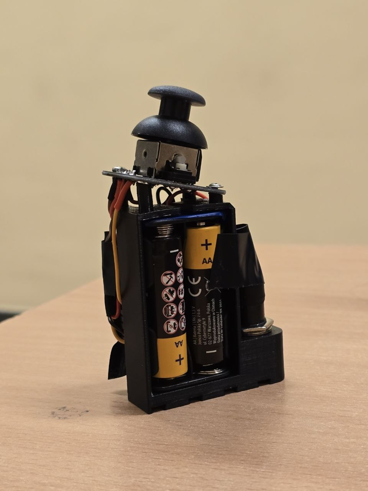
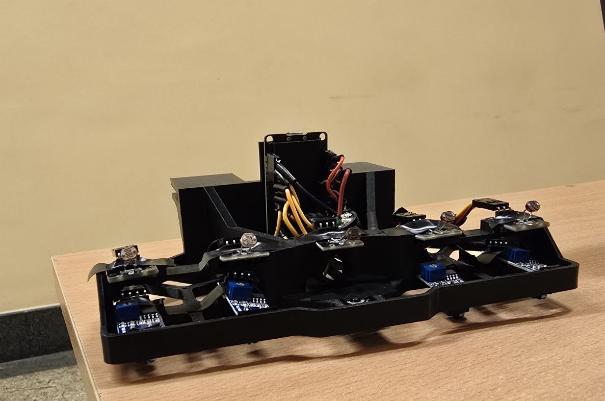

# ESP32 micro-ROS Controller

A dual-node embedded communication system combining ESP-NOW wireless communication with micro-ROS for ROS 2 robotics platforms.

The project connects a wireless ESP32 handheld controller with a robot-side ESP32 interface, creating a low-latency bridge between physical hardware and a ROS 2 system running on Jetson Nano.

---

## Overview

The system consists of two cooperating ESP32 firmware applications:

- a handheld wireless controller,
- a robot-side ESP32 micro-ROS bridge.

Together, they provide real-time operator input, sensor acquisition, and ROS 2 communication.

---

## System Architecture

### System overview



The two ESP32 devices communicate wirelessly using ESP-NOW, while the robot-side node integrates with ROS 2 through micro-ROS.

---

## Handheld Controller



The controller-side ESP32 acts as a wireless input device.

### Features

- joystick input acquisition
- push-button handling
- battery voltage monitoring
- ADC normalization based on battery level
- ESP-NOW telemetry transmission

The controller continuously sends normalized operator input data to the robot-side ESP32.

---

## Robot Interface



The robot-side ESP32 acts as the main embedded I/O bridge between robot hardware and ROS 2.

### Features

- ESP-NOW packet reception
- local analog sensor acquisition
- micro-ROS topic publishing
- ROS 2 command subscription
- buzzer output control

The firmware combines wireless operator input, onboard sensing, and ROS communication inside a FreeRTOS application.

---

## Functionality

### Wireless telemetry

The system transmits:

- joystick X/Y position
- controller button state
- controller battery voltage

Data is received by the robot-side ESP32 and forwarded into ROS 2 topics.

---

### Sensor acquisition

The robot-side ESP32 periodically reads onboard analog sensors.

Current setup includes:

- IR line detection sensors
- photoresistor light sensors

Sensor values are published to ROS 2 for higher-level processing on Jetson Nano.

---

## Firmware Design

Both ESP32 devices run independent FreeRTOS-based firmware.

The design focuses on:

- low-latency wireless communication
- concurrent task execution
- periodic ADC sampling
- non-blocking micro-ROS communication
- modular separation between controller and robot interface

---

## ADC Battery Compensation

Because the controller is battery-powered, joystick ADC values vary with supply voltage.

To improve consistency, the controller measures battery voltage and rescales joystick readings back into a normalized 12-bit range before transmission.

This reduces drift caused by battery discharge and provides more stable operator control.

---

## ROS 2 Topics

### Published topics

```text
/esp/sensors     # local robot sensor values
/esp/joystick    # joystick telemetry
/esp/button      # controller button state
/esp/battery     # controller battery voltage [mV]

### Subscribed topics

```text
/esp/horn        # buzzer activation command

---

### Youtube videos https://www.youtube.com/playlist?list=PLLbGYqHAyf1eH0HuIkOklTwuBiebvZPPm
